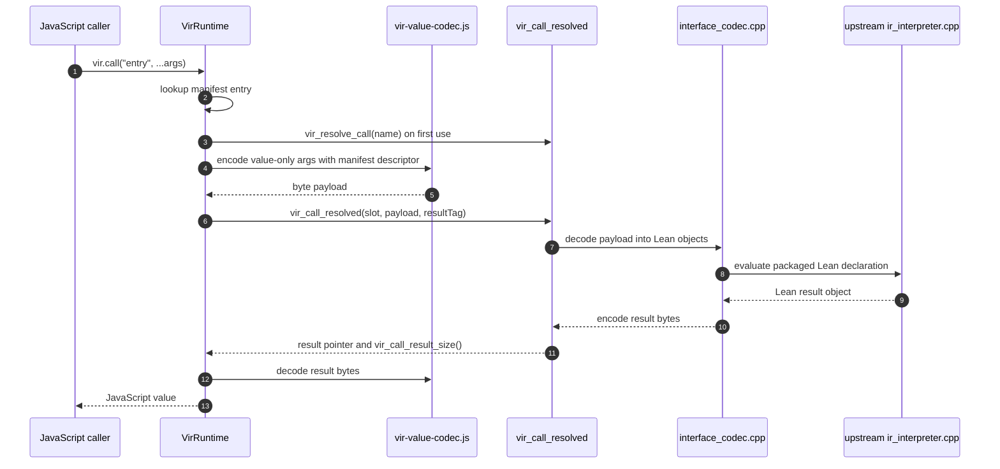
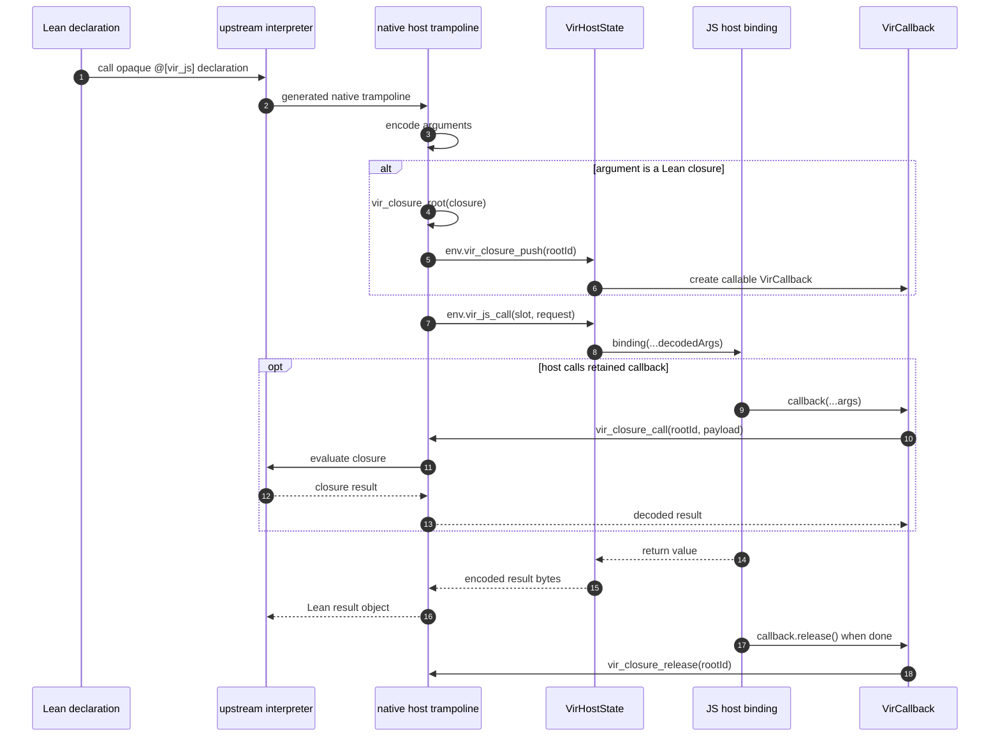
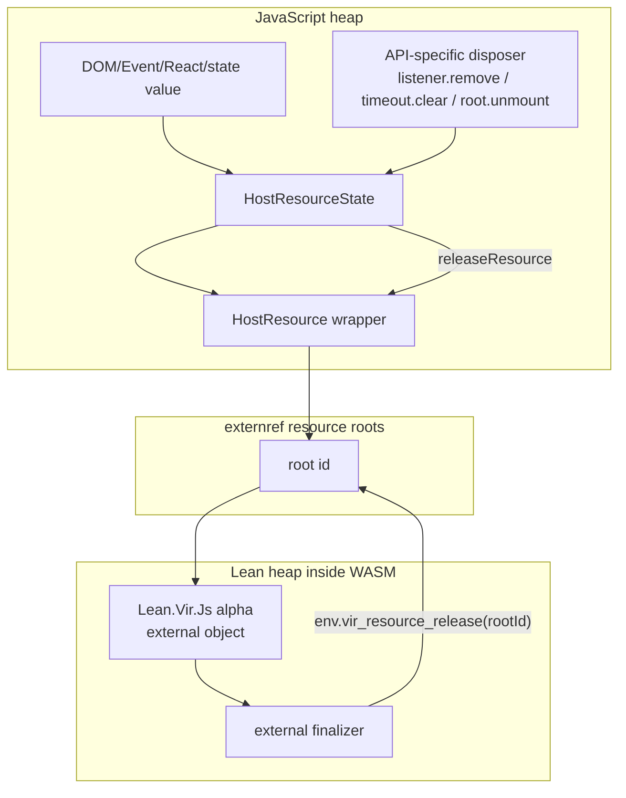
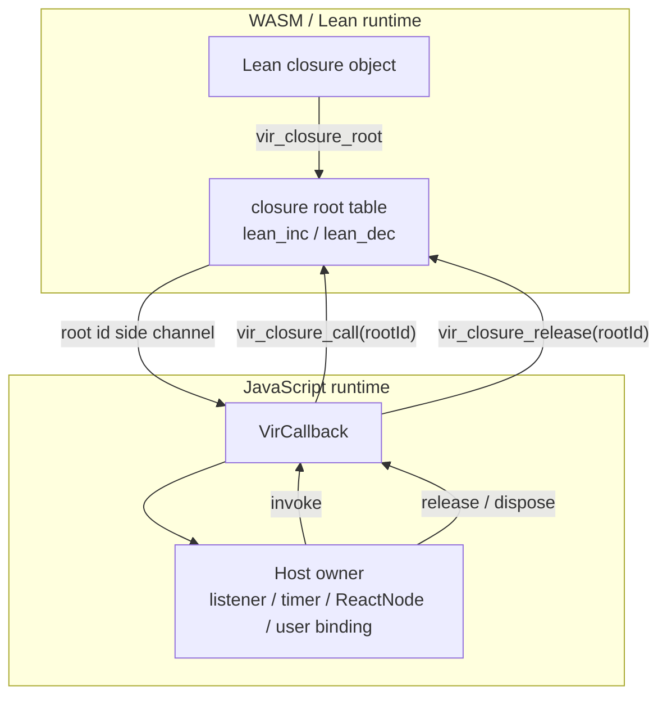
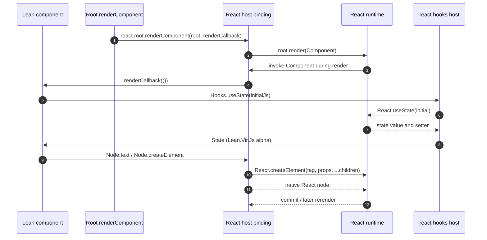

# Developer Guide

This guide is the implementation map for Lean VIR contributors. User-facing
setup stays in [README.md](../README.md); command details stay in
[HARNESS.md](HARNESS.md); this page explains where data flows and who owns
objects while a call is running.

## Implementation Map

| Work area | Primary files | What changes here |
| --- | --- | --- |
| Lean API | `Vir/*.lean`, `examples/*.lean` | Public combinators, effect types, examples, and `@[vir_js]` declarations. |
| Package generation | `Vir/GeneratePackage.lean` | Export closure selection, manifest type descriptors, host import metadata, and native extern registration. |
| WASI boundary | `wasm/upstream_shim/` | Resolved package calls, host-import trampolines, package decoding, native externs, closure roots, and WASI/runtime stubs. |
| JavaScript runtime | `web/src/vir-runtime.js`, `web/src/runtime/vir-value-codec.js` | Runtime construction, manifest validation, call payload encoding, result decoding, host import dispatch, and callback wrappers. |
| Host resources | `web/src/host-resource.js`, `web/src/host/vir-host-resources.js` | JavaScript-owned object handles, externref roots, disposable host objects, DOM/timer/frame/React resource cleanup. |
| React host | `web/src/react/`, `web/src/vir-react-host-bindings.js` | React element construction, root lifetime, function-component bridge, hooks, and callback retention. |
| Browser demos | `web/src/`, `examples/`, `fixtures/` | Local demo entry points, smoke fixtures, and generated `.irpkg` inputs. |
| Performance | `scripts/bench-vir.mjs`, [PERFORMANCE.md](PERFORMANCE.md) | Boundary conversion rows, dispatch rows, benchmark JSON, and before/after comparison. |

## Reading Paths

For package/interface work, read:

1. `docs/INTERFACE_PIPELINE.md`
2. `Vir/GeneratePackage.lean`
3. `web/src/runtime/vir-value-codec.js`
4. `wasm/upstream_shim/interface_codec.cpp`

For browser or React host work, read:

1. `docs/LEAN_VIR_LIBRARY.md`
2. `docs/HOST_BINDINGS.md`
3. `docs/REACT_NODE.md`
4. `web/src/host/vir-host-resources.js`
5. `web/src/react/vir-react-node.js`
6. `web/src/react/vir-react-hooks.js`

For WASI/runtime boundary work, read:

1. `docs/UPSTREAM_BOUNDARY.md`
2. `wasm/upstream_shim/README.md`
3. `wasm/upstream_shim/shim.cpp`
4. `wasm/upstream_shim/package_decl_provider.cpp`
5. `wasm/upstream_shim/native_symbols.cpp`

For benchmark work, read:

1. `docs/PERFORMANCE.md`
2. `scripts/bench-vir.mjs`
3. `scripts/bench-utils.mjs`
4. `scripts/runtime-tests/value-codec-smoke.mjs`

## Top-Level Call Flow

The normal JavaScript-to-Lean call path resolves an exported package entry once
and then reuses the package-local call slot.



The runtime's byte fallback path is `vir_call_resolved(slot, ...)`; the older
descriptor-bearing named call ABI has been removed.

## Lean-To-JavaScript Host Import Flow

Declarations marked with `@[vir_js "..."]` call into JavaScript through a
package-scoped host-import slot. Function-valued arguments are turned into
explicitly releasable `VirCallback` objects.



The host binding owns the lifetime of any `VirCallback` it stores. Built-in
bindings release callbacks when listeners are removed, timers or animation
frames fire or are cancelled, React subtrees are replaced or unmounted, the
package is reloaded, or the runtime is disposed.

## Object Ownership

There are two separate ownership systems:

- JavaScript-owned objects cross into Lean as `Lean.Vir.Js α` resources.
- Lean closures cross into JavaScript as `VirCallback` objects.

They use different root tables and different release paths.



Important details:

- The `Lean.Vir.Js α` type parameter is a Lean-side marker. All such values use
  the same generic `Js` resource lane in the package manifest.
- The externref root id keeps the `HostResource` wrapper addressable while the
  Lean heap holds it. Releasing the root id does not by itself remove a DOM
  listener, cancel a frame, or unmount a React root.
- API-specific cleanup is owned by `HostResourceState` and the binding that
  created the object. Runtime disposal and package reload call that cleanup
  path before clearing the resource roots.
- Stale resources are invalidated. Passing a released resource back through a
  host binding is an error instead of silently reusing the JavaScript value.

Lean closure ownership is symmetric but not identical:



`VirCallback.release()` is idempotent. Calling a released callback fails. The
runtime tracks live callbacks as a last-resort cleanup path, but host bindings
should release callbacks at their natural lifetime boundary.

## React Component Flow

Lean-authored React components are shallowly embedded. The host creates real
React nodes with `React.createElement`, and `Root.renderComponent` wraps a Lean
render function in a JavaScript React function component so hooks run under
React's normal dispatcher.



The current API intentionally follows ordinary React semantics. Render
functions are authored in `ReactM`, DOM/root operations live in `DomM`, and
real host IO remains outside the React component effect. `Root.render` is the
host boundary for static tree rendering: the raw host import accepts a render
action of type `ReactM (Lean.Vir.Js Node)`, invokes that action to obtain the
concrete `Js Node`, renders it, and releases the render callback. This is a
shallow embedding: it aims to make existing React/ProofWidgets-style code
portable before introducing higher-level safety abstractions.

## Adding A Host Import

Use this checklist when adding a new host-backed primitive:

1. Add the Lean declaration with the narrowest effect that matches the
   operation: pure, `DomM`, or `ReactM`.
2. Make JavaScript-owned objects appear as `Lean.Vir.Js α`, not as naked marker
   types.
3. Run or update package-generation tests so `Vir/GeneratePackage.lean`
   validates the argument and result types.
4. Add the JavaScript binding in the relevant host module.
5. If the binding retains a callback or host object, wire its cleanup into
   `HostResourceState` or an equivalent disposer.
6. Add runtime tests for the happy path, stale/released resources, package
   reload, and runtime disposal.
7. Add browser smoke coverage when the behavior depends on real DOM or React.

## Validation Pointers

Common focused checks:

```bash
npm run build:demo
npm run test:runtime
npm run test:upstream:no-build
npm run test:pages
npm run test:pages:browser
npm run bench -- --json /tmp/vir-bench.json
```

Use the narrower command that matches the change first, then broaden when the
change touches shared runtime, package generation, or browser-facing behavior.
