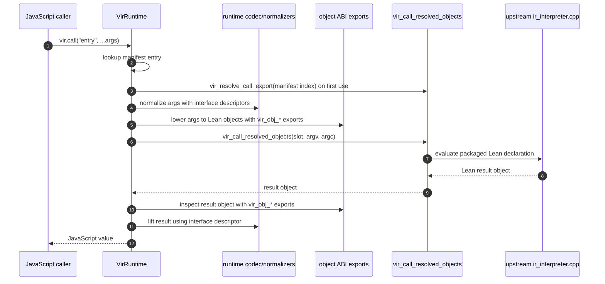
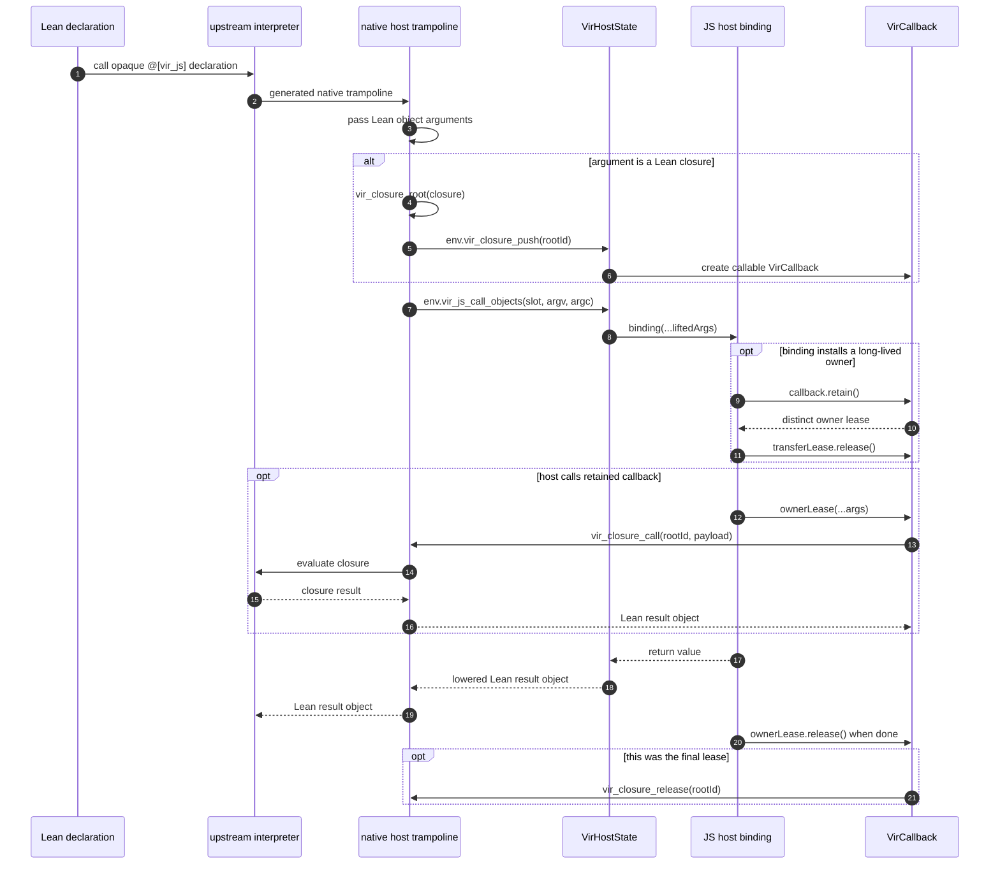
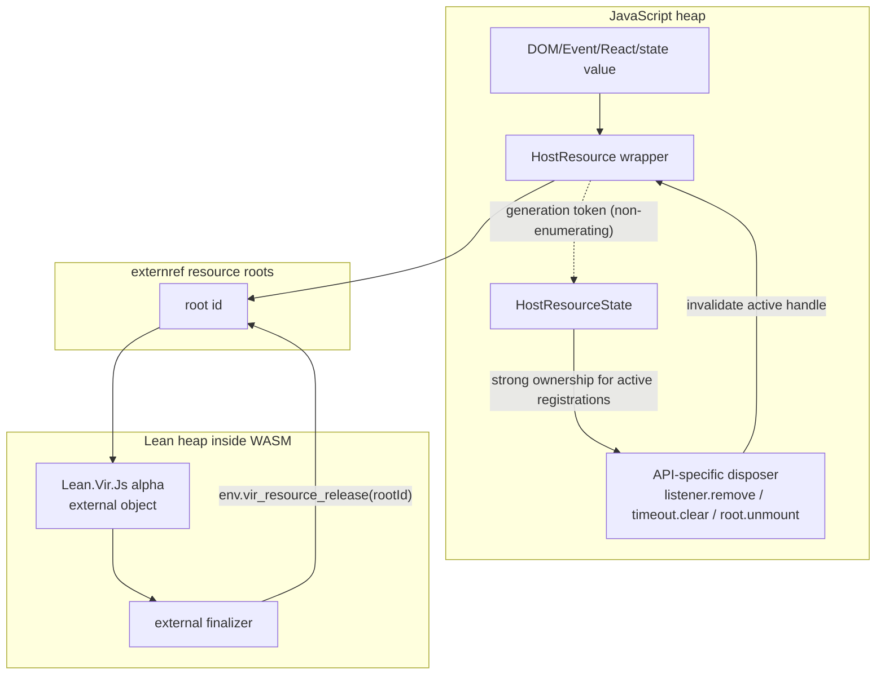
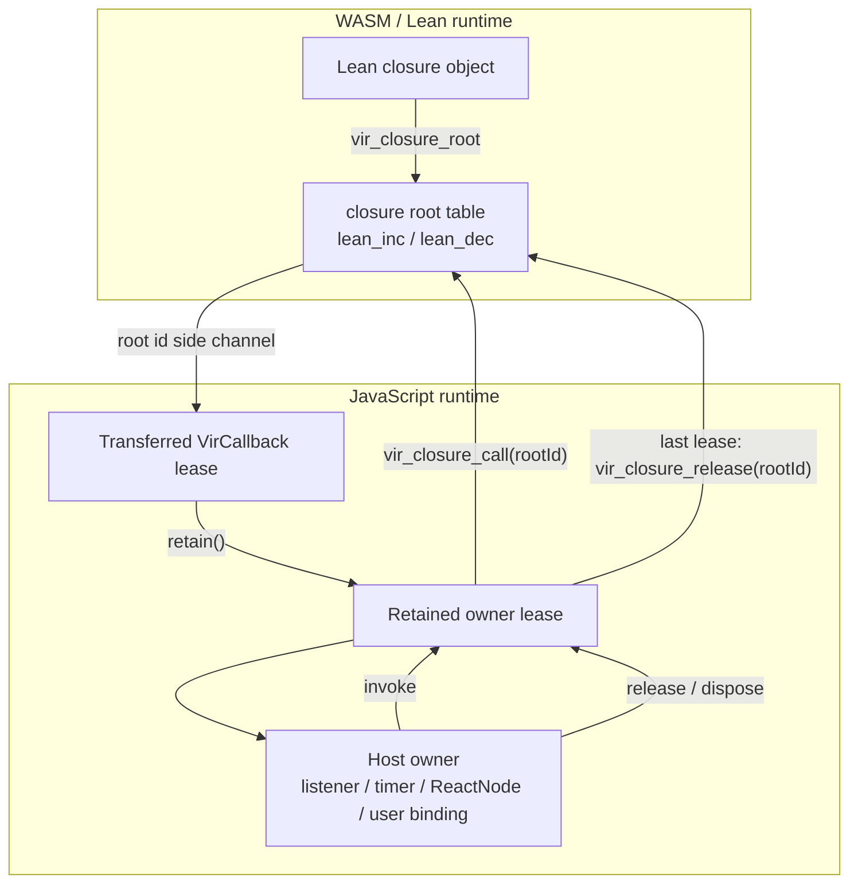
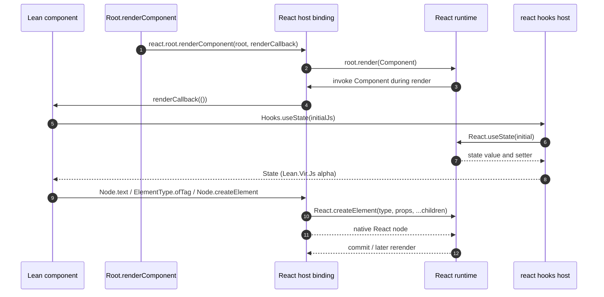

# Developer Guide

This guide is the implementation map for Lean VIR contributors. User-facing
setup stays in [README.md](../README.md); command details stay in
[HARNESS.md](HARNESS.md); this page explains where data flows and who owns
objects while a call is running.

## Implementation Map

| Work area | Primary files | What changes here |
| --- | --- | --- |
| Lean API | `Vir/*.lean`, `examples/*.lean` | Public combinators, effect types, examples, and `@[vir_js]` declarations. |
| Package generation | `Vir/GeneratePackage.lean`, `Vir/GeneratePackage/Interface/` | Export closure selection, manifest type descriptors, host import metadata, and native extern registration. |
| WASI boundary | `wasm/upstream_shim/` | `vir_call`, host-import trampolines, package decoding, native externs, closure roots, and WASI/runtime stubs. |
| JavaScript runtime | `web/src/vir-runtime.js`, `web/src/runtime/` | Runtime construction, manifest validation, package call resolution, object ABI lowering/lifting, host import dispatch, and callback wrappers. |
| Host resources | `web/src/host-resource.js`, `web/src/host/vir-host-resources.js` | JavaScript-owned object handles, externref roots, disposable host objects, DOM/timer/frame/React resource cleanup. |
| React host | `web/src/react/`, `web/src/vir-react-host-bindings.js` | React element construction, root lifetime, function-component bridge, hooks, and callback retention. |
| Browser demos | `web/src/`, `examples/`, `fixtures/` | Local demo entry points, smoke fixtures, and generated `.irpkg` inputs. |
| Performance | `benchmarks/harness/bench-vir.mjs`, `benchmarks/harness/bench-differential.mjs`, [PERFORMANCE.md](PERFORMANCE.md) | Boundary conversion rows, differential sampling, benchmark JSON, and before/after comparison. |

## Reading Paths

For package/interface work, read:

1. `docs/INTERFACE_PIPELINE.md`
2. `docs/GENERATE_PACKAGE.md`
3. `Vir/InterfaceValidation.lean`
4. `Vir/Interface/Model.lean`
5. `Vir/Interface/Classify/Error.lean`
6. `Vir/Interface/Classify/Core.lean`
7. `Vir/Interface/Classify/Signature.lean`
8. `Vir/HostMetadata.lean`
9. `Vir/HostValidation.lean`
10. `Vir/GeneratePackage/Interface/Encode.lean`
11. `web/src/runtime/interface-manifest.js`
12. `web/src/runtime/core.js`
13. `web/src/runtime/object-values.js`
14. `web/src/runtime/vir-codec.js`
15. `web/src/runtime/object-abi.js`
16. `web/src/runtime/vir-value-normalizers.js`

For browser or React host work, read:

1. `docs/LEAN_VIR_LIBRARY.md`
2. `docs/HOST_BINDINGS.md`
3. `docs/REACT_NODE.md`
4. `web/src/host/vir-host-resources.js`
5. `web/src/react/vir-react-node.js`
6. `web/src/react/vir-react-hooks.js`

For WASI/runtime boundary work, read:

1. `docs/UPSTREAM_BOUNDARY.md`
2. `wasm/upstream_shim/README.md`
3. `wasm/upstream_shim/interpreter/interpreter_bridge.cpp`
4. `wasm/upstream_shim/abi/call_abi.cpp`
5. `wasm/upstream_shim/abi/closure_abi.cpp`
6. `wasm/upstream_shim/package/host_import_trampolines.cpp`
7. `wasm/upstream_shim/package/package_decl_provider.cpp`
8. `wasm/upstream_shim/package/package_section_directory.cpp`
9. `wasm/upstream_shim/package/package_ir_decoder.cpp`
10. `wasm/upstream_shim/runtime/native_symbols.cpp`
11. `tools/GenerateNativeWrappers.lean`
12. `wasm/upstream_shim/runtime/native_symbol_lookup.cpp`
13. `wasm/upstream_shim/abi/object_abi.cpp`
14. `wasm/upstream_shim/abi/object_expr_abi.cpp`

For benchmark work, read:

1. `docs/PERFORMANCE.md`
2. `benchmarks/harness/bench-vir.mjs`
3. `benchmarks/harness/bench-differential.mjs`
4. `benchmarks/harness/bench-utils.mjs`
5. `tests/runtime/object-abi-smoke.mjs`

## Top-Level Call Flow

The normal JavaScript-to-Lean call path resolves an exported package entry once
and then reuses the package-local call slot.


```mermaid
sequenceDiagram
    autonumber
    participant JS as JavaScript caller
    participant RT as VirRuntime
    participant Codec as runtime codec/normalizers
    participant Obj as object ABI exports
    participant Wasm as vir_call_resolved_objects
    participant IR as upstream ir_interpreter.cpp

    JS->>RT: vir.call("entry", ...args)
    RT->>RT: lookup manifest entry
    RT->>Wasm: vir_resolve_call_export(manifest index) on first use
    RT->>Codec: normalize args with interface descriptors
    RT->>Obj: lower args to Lean objects with vir_obj_* exports
    RT->>Wasm: vir_call_resolved_objects(slot, argv, argc)
    Wasm->>IR: evaluate packaged Lean declaration
    IR-->>Wasm: Lean result object
    Wasm-->>RT: result object
    RT->>Obj: inspect result object with vir_obj_* exports
    RT->>Codec: lift result using interface descriptor
    RT-->>JS: JavaScript value
```

The runtime uses interface descriptors plus the object ABI for exported manifest
calls. It resolves each entry once, lowers JavaScript values according to the
export descriptors, and then calls
`vir_call_resolved_objects(slot, ...)`.

## Lean-To-JavaScript Host Import Flow

Declarations marked with `@[vir_js "..."]` call into JavaScript through a
package-scoped host-import slot. Function-valued arguments are turned into
explicitly releasable `VirCallback` objects.


```mermaid
sequenceDiagram
    autonumber
    participant Lean as Lean declaration
    participant IR as upstream interpreter
    participant Shim as native host trampoline
    participant Host as VirHostState
    participant JS as JS host binding
    participant Callback as VirCallback

    Lean->>IR: call opaque @[vir_js] declaration
    IR->>Shim: generated native trampoline
    Shim->>Shim: pass Lean object arguments
    alt argument is a Lean closure
        Shim->>Shim: vir_closure_root(closure)
        Shim->>Host: env.vir_closure_push(rootId)
        Host->>Callback: create callable VirCallback
    end
    Shim->>Host: env.vir_js_call_objects(slot, argv, argc)
    Host->>JS: binding(...liftedArgs)
    opt binding installs a long-lived owner
        JS->>Callback: callback.retain()
        Callback-->>JS: distinct owner lease
        JS->>Callback: transferLease.release()
    end
    opt host calls retained callback
        JS->>Callback: ownerLease(...args)
        Callback->>Shim: vir_closure_call(rootId, payload)
        Shim->>IR: evaluate closure
        IR-->>Shim: closure result
        Shim-->>Callback: Lean result object
    end
    JS-->>Host: return value
    Host-->>Shim: lowered Lean result object
    Shim-->>IR: Lean result object
    JS->>Callback: ownerLease.release() when done
    opt this was the final lease
        Callback->>Shim: vir_closure_release(rootId)
    end
```

The host binding receives one transferable `VirCallback` lease. Built-in
registrations acquire a distinct lease with `retain()`, relinquish the transfer
lease, and release their owned lease when listeners are removed, timers or
animation frames fire or are cancelled, React subtrees are replaced or
unmounted, the package is reloaded, or the runtime is disposed.

## Object Ownership

There are two separate ownership systems:

- JavaScript-owned objects cross into Lean as `Lean.Vir.Js α` resources.
- Lean closures cross into JavaScript as `VirCallback` objects.

They use different root tables and different release paths.


```mermaid
flowchart TD
    subgraph JS["JavaScript heap"]
        Value["DOM/Event/React/state value"]
        Resource["HostResource wrapper"]
        Store["HostResourceState"]
        Disposer["API-specific disposer\nlistener.remove / timeout.clear / root.unmount"]
    end

    subgraph Externref["externref resource roots"]
        RootId["root id"]
    end

    subgraph Lean["Lean heap inside WASM"]
        Handle["Lean.Vir.Js alpha\nexternal object"]
        Finalizer["external finalizer"]
    end

    Value --> Resource
    Resource --> RootId
    RootId --> Handle
    Handle --> Finalizer
    Finalizer -->|"env.vir_resource_release(rootId)"| RootId
    Resource -.->|"generation token (non-enumerating)"| Store
    Store -->|"strong ownership for active registrations"| Disposer
    Disposer -->|"invalidate active handle"| Resource
```

Important details:

- The `Lean.Vir.Js α` type parameter is a Lean-side marker. All such values use
  the same generic `Js` resource lane in the package manifest.
- The externref root id keeps the `HostResource` wrapper addressable while the
  Lean heap holds it. Releasing the root id does not by itself remove a DOM
  listener, cancel a frame, or unmount a React root.
- Passive wrappers are not strongly retained by `HostResourceState`. Their
  lifetime is ordinary JavaScript reachability plus any Lean externref root.
- API-specific cleanup for active registrations is owned by
  `HostResourceState` and the binding that created the object. Runtime disposal
  and package reload call that cleanup path before clearing resource roots.
- Stale resources are invalidated. Passing a released resource back through a
  host binding is an error instead of silently reusing the JavaScript value.
- The canonical host-resource ownership policy, including callback-local
  handles, callback leases, and React/JSL alias ownership, is maintained in
  [HOST_BINDINGS.md](HOST_BINDINGS.md#resource-ownership-policy).

Lean closure ownership is symmetric but not identical:


```mermaid
flowchart TD
    subgraph Wasm["WASM / Lean runtime"]
        Closure["Lean closure object"]
        ClosureRoot["closure root table\nlean_inc / lean_dec"]
    end

    subgraph JS["JavaScript runtime"]
        Callback["Transferred VirCallback lease"]
        Lease["Retained owner lease"]
        Owner["Host owner\nlistener / timer / ReactNode / user binding"]
    end

    Closure -->|"vir_closure_root"| ClosureRoot
    ClosureRoot -->|"root id side channel"| Callback
    Callback -->|"retain()"| Lease
    Lease --> Owner
    Owner -->|"invoke"| Lease
    Lease -->|"vir_closure_call(rootId)"| ClosureRoot
    Owner -->|"release / dispose"| Lease
    Lease -->|"last lease: vir_closure_release(rootId)"| ClosureRoot
```

`VirCallback.release()` is idempotent for that lease. Calling a released lease
fails, while sibling leases remain callable. The runtime tracks roots as a
last-resort cleanup path and force-revokes every outstanding lease during
package/runtime teardown, but host bindings should release their leases at the
natural owner boundary.

## React Component Flow

Lean-authored React components are shallowly embedded. The host creates real
React nodes with `React.createElement`, and `Root.renderComponent` wraps a Lean
render function in a JavaScript React function component so hooks run under
React's normal dispatcher.


```mermaid
sequenceDiagram
    autonumber
    participant Lean as Lean component
    participant Root as Root.renderComponent
    participant Host as React host binding
    participant React as React runtime
    participant Hooks as react hooks host

    Root->>Host: react.root.renderComponent(root, renderCallback)
    Host->>React: root.render(Component)
    React->>Host: invoke Component during render
    Host->>Lean: renderCallback(())
    Lean->>Hooks: Hooks.useState(initialJs)
    Hooks->>React: React.useState(initial)
    React-->>Hooks: state value and setter
    Hooks-->>Lean: State (Lean.Vir.Js alpha)
    Lean->>Host: Node.text / ElementType.ofTag / Node.createElement
    Host->>React: React.createElement(type, props, ...children)
    Host-->>React: native React node
    React-->>Host: commit / later rerender
```

The current API intentionally follows ordinary React semantics. JavaScript
resource/runtime operations live in `RuntimeM`, render functions are authored
in `ReactM`, DOM/root operations live in `DomM`, and real host IO remains
outside the React component effect. `Root.renderNode` is the faithful raw
boundary corresponding to `root.render(reactNode)` and borrows a `Js Node`.
`Root.render` is the generated static-tree convenience: its host import accepts
a render action of type `ReactM (Lean.Vir.Js Node)`, invokes that action once,
forwards the concrete node, and releases the render callback. This is a shallow
embedding: it aims to make existing React/ProofWidgets-style code portable
before introducing higher-level safety abstractions.

## Adding A Host Import

Use this checklist when adding a new host-backed primitive:

1. Add the Lean declaration with the narrowest effect that matches the
   operation: pure, `RuntimeM`, `IO`, `DomM`, or `ReactM`.
2. Make JavaScript-owned objects appear as `Lean.Vir.Js α`, not as naked marker
   types.
3. Run or update package-generation tests so
   `Vir/Interface/Classify/Core.lean` and
   `Vir/Interface/Classify/Signature.lean` validate the argument and result
   types.
4. Add the JavaScript binding in the relevant host module.
5. If the binding retains a callback or host object, connect its cleanup to
   `HostResourceState` or an equivalent disposer.
6. Add runtime tests for the happy path, stale/released resources, package
   reload, and runtime disposal.
7. Add browser smoke coverage when the behavior depends on real DOM or React.

## Validation Pointers

Common focused checks:

```bash
npm run build:demo
npm run test:runtime
npm run test:upstream:no-build
npm run test:pages
npm run test:pages:browser
npm run test:bench
npm run bench -- --json /tmp/vir-bench.json
```

Use the narrower command that matches the change first, then broaden when the
change touches shared runtime, package generation, or browser-facing behavior.
