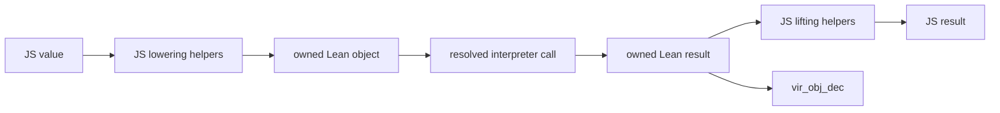
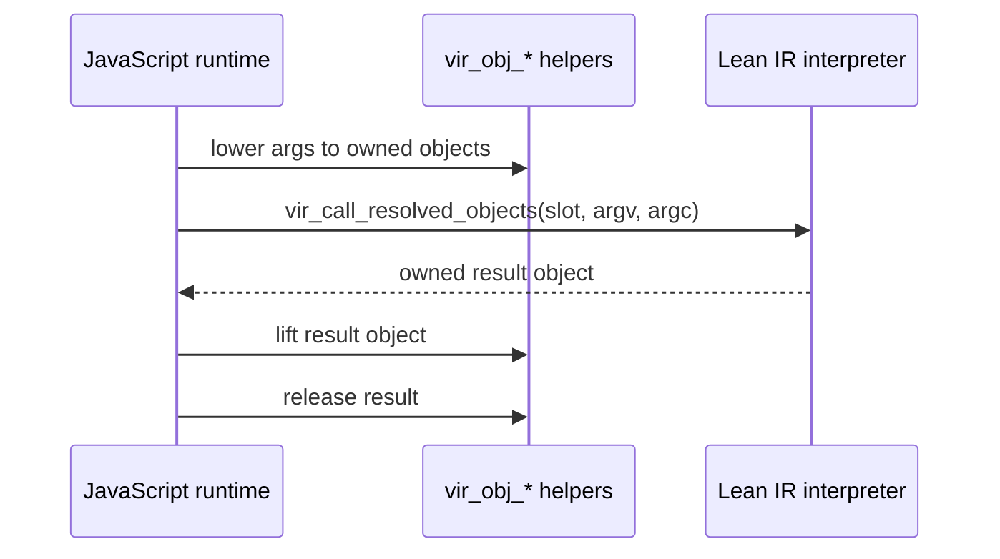

# Lean Object ABI

This note records the direction for replacing the C++ byte value codec with
JavaScript-driven construction and inspection of Lean runtime objects.

The compact manifest-driven byte path remains the general boundary. The object
ABI is an internal experimental surface that lets the JavaScript runtime
lower common JS values into Lean objects, call the interpreter with object
arguments, and lift the returned Lean object back to JS without descriptor bytes
on every call.

## Boundary Policy

There are two distinct lanes:

- JavaScript-owned objects with identity, lifetime, mutability, or host API
  behavior cross as `Lean.Vir.Js α` resources. The `α` parameter is a Lean-side
  phantom marker while the value remains in JavaScript. Known DOM/React markers
  such as `Lean.Vir.Browser.Element`, `Lean.Vir.Browser.Event`, and
  `Lean.Vir.React.Root` must appear under `Lean.Vir.Js`; naked marker types are
  rejected by package generation.
- Plain Lean values cross as ordinary manifest value types. This includes
  scalars, strings, byte arrays, arrays, options, structures, and custom
  inductives over supported fields. They are copied/lowered/lifted values, not
  JavaScript identity handles.

The object ABI does not change the public Lean signature policy. It is a lower
runtime implementation path for the plain-value lane: JavaScript may eventually
construct Lean objects directly for common manifest value types instead of
sending descriptor-guided byte payloads. `Lean.Vir.Js α` remains the explicit
resource lane for host-owned objects.

## Shape

The initial exported object helper surface is deliberately small:

- `vir_obj_string` / `vir_obj_string_data` / `vir_obj_string_size`
- `vir_obj_byte_array` / `vir_obj_byte_array_data` / `vir_obj_byte_array_size`
- `vir_obj_array`
- `vir_obj_list`
- `vir_obj_ctor`
- `vir_obj_scalar` / `vir_obj_is_scalar` / `vir_obj_scalar_value`
- `vir_obj_tag` / `vir_obj_field`
- `vir_obj_nat` / `vir_obj_nat_decimal`
- `vir_obj_int` / `vir_obj_int_decimal`
- `vir_obj_uint32` / `vir_obj_uint32_value`
- `vir_obj_uint64` / `vir_obj_uint64_decimal`
- `vir_obj_usize` / `vir_obj_usize_decimal`
- `vir_obj_float` / `vir_obj_float_value`
- `vir_obj_float32` / `vir_obj_float32_value`
- `vir_obj_decimal_size`
- `vir_obj_inc` / `vir_obj_dec`
- `vir_call_resolved_objects`

Strings and byte arrays return borrowed pointers into the Lean object. JavaScript
must read the bytes while the object is still live. The pointer becomes invalid
after `vir_obj_dec` releases the object or after the runtime is torn down.
The decimal scalar inspection helpers return a borrowed pointer into a shim-owned
scratch buffer; JavaScript must read it before the next decimal inspection helper
call or runtime teardown.
`vir_obj_array` consumes an array of owned Lean object pointers and returns one
owned Lean array object. If it fails before consuming them, JavaScript still owns
the element references and must release them.
`vir_obj_list` follows the same ownership rule and builds a Lean list in input
order.
`vir_obj_ctor` consumes owned field references and returns one owned constructor
object with object fields only. If construction fails before consuming fields,
JavaScript still owns the field references. `vir_obj_field` returns a new owned
reference to the requested object field, so JavaScript must release it.

## Ownership

Object constructors return an owned Lean object pointer. JavaScript owns
that reference and must release it with `vir_obj_dec` unless a call helper
explicitly documents that it consumes ownership. `vir_obj_inc` can be used to
retain an object across a helper call that consumes one reference.

`vir_call_resolved_objects(slot, argv, argc)` consumes every owned object in the
`argv` array once called, including early validation failures after a non-null
`argv` pointer has been accepted. On success it returns an owned Lean object
result that JavaScript must release with `vir_obj_dec` after lifting. A returned
pointer of `0` is the null failure sentinel; JavaScript should inspect
`vir_call_error_size` for the diagnostic. The helper uses a generated `_boxed`
declaration when the package has one. If there is no `_boxed` declaration, it
may call the base declaration only when the package signature does not require a
boxed wasm32 boundary for the top-level argument or result type.

Immediate scalar objects are allowed. They are still non-null object values at
the ABI boundary. `vir_obj_inc` and `vir_obj_dec` are the only public operations
JS should use; Lean's runtime treats scalars as no-ops for refcounting.

Object pointers are scoped to one wasm runtime instance. They must not survive:

- `VirRuntime.dispose`
- package reload
- wasm instance teardown
- a future interpreter reset that releases package state

Longer-lived values should use an explicit root table. Closure and host-resource
roots already follow that pattern; object roots should use the same discipline
when we add them.

## Call Path Target

The target call path is:

The compact byte payload path remains the complete path while this lands. It
handles structured values, resources, callbacks, and host imports. Primitive
lane helpers are still useful for the hottest exact scalar signatures because
they avoid both byte payloads and object allocation.
The automatic object-lane selection in `VirRuntime.call` covers pure unary calls
whose argument can be lowered from the current object subset and whose result can
be lifted from it. Arguments currently support base values, `Array`, `List`,
`Option`, and `Prod`; sequence and product fields are lowered recursively.
Results currently support base values, `Option`, and `Prod`; array/list result
inspection still falls back to the byte codec. Decimal scalar calls lower through
the corresponding `vir_obj_*` constructor, call `vir_call_resolved_objects`, lift
the result with the matching decimal inspection helper plus
`vir_obj_decimal_size`, and release the owned result with `vir_obj_dec`.
Byte-array calls use `vir_obj_byte_array` and lift the result with
`vir_obj_byte_array_data` / `vir_obj_byte_array_size`. Sequence calls lower each
supported element to an owned object and pack those objects with `vir_obj_array`
or `vir_obj_list`.

## Phases

1. Base object primitives: String, decimal scalar, and ByteArray construction
   and inspection, plus ownership tests.
2. Object call helpers: resolved calls that accept already-lowered owned object
   arguments and return an owned object result.
3. Bulk builders: arrays, strings, and byte arrays with fewer intermediate
   copies for common browser data. The first sequence builders handle shallow
   object arrays and lists; generated metadata should eventually drive the
   general case.
4. Generated layout support: structures and inductives lowered by package
   metadata instead of ad hoc descriptors.
5. Host import integration: rooted object handles for Lean-to-JS calls where JS
   wants to inspect or retain Lean objects directly.
6. Codec retirement: remove the C++ descriptor/value codec once JS-driven
   lowering covers the manifest surface we need.

## Risks

- Refcount mistakes are correctness bugs. Tests should cover every helper that
  transfers or consumes ownership.
- Lean's boxed and unboxed representations are runtime details. The exported
  helpers are the boundary; JavaScript should not infer layouts from pointer
  values.
- String conversion still copies between JS UTF-16 and Lean UTF-8. This ABI can
  avoid descriptor overhead, but it does not make Lean strings share JS storage.
- Descriptor-free object calls must trust package metadata. The package version
  needs to stay tied to the generated signature/layout tables used by the JS
  lowering code.
- JS-facing bindings should choose between ordinary value types and
  `Lean.Vir.Js α` resources based on semantics, not on the current lower-level
  transport. The object ABI is an internal optimization path for ordinary value
  types; it is not the public representation for JavaScript-owned objects.
