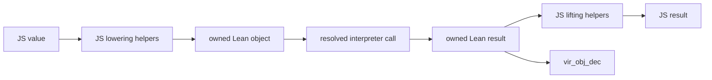
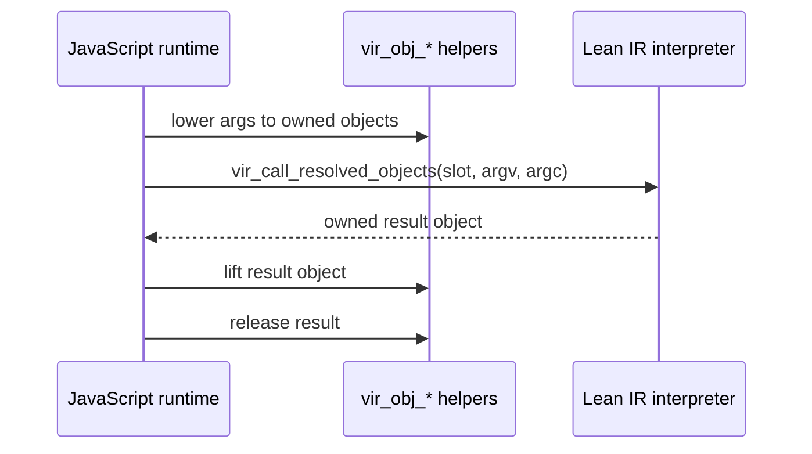

# Lean Object ABI

This note records the JavaScript-driven construction and inspection path for
Lean runtime objects.

The object ABI is now the JavaScript runtime call surface for package
entrypoints, host imports, callbacks, and resources. The compact binary codec
that remains in this area encodes package type descriptors/signatures, not
runtime values.

## Boundary Policy

There are two distinct lanes:

- JavaScript-owned objects with identity, lifetime, mutability, or host API
  behavior cross as `Lean.Vir.Js α` resources. The `α` parameter is a Lean-side
  phantom marker while the value remains in JavaScript. Known DOM/React markers
  such as `Lean.Vir.Browser.Element`, `Lean.Vir.Browser.Event`, and
  `Lean.Vir.React.Root` must appear under `Lean.Vir.Js`; naked marker types are
  rejected by package generation.
- Plain Lean values cross as ordinary manifest value types. This includes
  scalars, strings, byte arrays, arrays, options, structures, and custom
  inductives over supported fields. They are copied/lowered/lifted values, not
  JavaScript identity handles.

The object ABI does not change the public Lean signature policy. It is the
runtime implementation path for the plain-value lane: JavaScript constructs
Lean objects directly for supported manifest value types. `Lean.Vir.Js α`
remains the explicit resource lane for host-owned objects.

## Shape

## Export Surface

This table is the human-readable object ABI contract. The smoke test guards the
required export names; this table documents what each export is for and what
ownership rule JavaScript must follow. Package loading, package manifest, and
raw wasm memory allocation exports are part of the broader package ABI and are
documented in [UPSTREAM_BOUNDARY.md](UPSTREAM_BOUNDARY.md).

| Export | Role | Ownership and lifetime |
| --- | --- | --- |
| `vir_resolve_call` | Resolve a package entry name to a stable call slot. | Does not transfer object ownership. |
| `vir_call_resolved_objects` | Call a resolved package slot with already-lowered Lean object arguments. | Consumes all argument objects after accepting a non-null `argv`; returns one owned result object or `0` on failure. |
| `vir_call_error` | Return a borrowed pointer to the last package object-call diagnostic. | Borrowed until the next object call or package/runtime teardown. |
| `vir_call_error_size` | Return the byte length of `vir_call_error`. | No object ownership. |
| `vir_obj_string` | Build a Lean `String` from UTF-8 bytes. | Returns an owned Lean string object. |
| `vir_obj_string_data` | Inspect a Lean `String` as UTF-8 bytes. | Returns a borrowed pointer into the live string object. |
| `vir_obj_string_size` | Return the byte length for `vir_obj_string_data`. | No object ownership. |
| `vir_obj_byte_array` | Build a Lean `ByteArray` from bytes. | Returns an owned Lean byte-array object. |
| `vir_obj_byte_array_data` | Inspect a Lean `ByteArray` as bytes. | Returns a borrowed pointer into the live byte-array object. |
| `vir_obj_byte_array_size` | Return the byte length for `vir_obj_byte_array_data`. | No object ownership. |
| `vir_obj_array` | Build a Lean `Array` from owned element objects. | Consumes all element objects on success; returns an owned array object. |
| `vir_obj_array_size` | Return a Lean `Array` size. | No object ownership. |
| `vir_obj_array_get` | Read one Lean `Array` element. | Returns a new owned reference to the element. |
| `vir_obj_ctor` | Allocate a constructor with object fields only. | Consumes all field objects on success; returns an owned constructor object. |
| `vir_obj_ctor_layout` | Allocate a constructor with object fields, `USize` slots, and packed scalar bytes. | Consumes object fields on success; returns an owned constructor object. |
| `vir_obj_ctor_usize_decimal` | Inspect one constructor `USize` slot as decimal text. | Returns a borrowed pointer into shim-owned decimal scratch storage. |
| `vir_obj_ctor_scalar_data` | Inspect the packed scalar byte area of a constructor. | Returns a borrowed pointer into the live constructor object. |
| `vir_obj_scalar` | Build an immediate scalar constructor value. | Returns a non-null Lean scalar object value; refcount operations are no-ops. |
| `vir_obj_is_scalar` | Test whether an object is an immediate scalar. | No object ownership. |
| `vir_obj_scalar_value` | Read an immediate scalar value. | No object ownership. |
| `vir_obj_tag` | Read a constructor tag. | No object ownership. |
| `vir_obj_field` | Read one object field from a constructor. | Returns a new owned reference to the field. |
| `vir_obj_nat` | Build a Lean `Nat` from decimal text. | Returns an owned Nat object. |
| `vir_obj_nat_decimal` | Inspect a Lean `Nat` as decimal text. | Returns a borrowed pointer into shim-owned decimal scratch storage. |
| `vir_obj_int` | Build a Lean `Int` from signed decimal text. | Returns an owned Int object. |
| `vir_obj_int_decimal` | Inspect a Lean `Int` as signed decimal text. | Returns a borrowed pointer into shim-owned decimal scratch storage. |
| `vir_obj_uint32` | Build a Lean `UInt32`. | Returns an owned boxed `UInt32` object. |
| `vir_obj_uint32_value` | Inspect a Lean `UInt32`. | No object ownership. |
| `vir_obj_uint64` | Build a Lean `UInt64` from decimal text. | Returns an owned boxed `UInt64` object. |
| `vir_obj_uint64_decimal` | Inspect a Lean `UInt64` as decimal text. | Returns a borrowed pointer into shim-owned decimal scratch storage. |
| `vir_obj_usize` | Build a Lean `USize` from decimal text. | Returns an owned boxed `USize` object. |
| `vir_obj_usize_decimal` | Inspect a Lean `USize` as decimal text. | Returns a borrowed pointer into shim-owned decimal scratch storage. |
| `vir_obj_float` | Build a Lean `Float`. | Returns an owned boxed float object. |
| `vir_obj_float_value` | Inspect a Lean `Float`. | No object ownership. |
| `vir_obj_float32` | Build a Lean `Float32`. | Returns an owned boxed float32 object. |
| `vir_obj_float32_value` | Inspect a Lean `Float32`. | No object ownership. |
| `vir_obj_decimal_size` | Return the byte length of the most recent decimal inspection result. | No object ownership. |
| `vir_obj_level_zero` | Build `Lean.Level.zero`. | Returns the scalar zero level. |
| `vir_obj_level_succ` | Build `Lean.Level.succ`. | Consumes the child level on success; returns an owned level object. |
| `vir_obj_level_max` | Build `Lean.Level.max`. | Consumes both level arguments on success; returns an owned level object. |
| `vir_obj_level_imax` | Build `Lean.Level.imax`. | Consumes both level arguments on success; returns an owned level object. |
| `vir_obj_level_param` | Build `Lean.Level.param` from a dotted name. | Returns an owned level object. |
| `vir_obj_level_mvar` | Build `Lean.Level.mvar` from a dotted name. | Returns an owned level object. |
| `vir_obj_literal_nat` | Build a `Lean.Literal.natVal`. | Returns an owned literal object. |
| `vir_obj_literal_string` | Build a `Lean.Literal.strVal`. | Returns an owned literal object. |
| `vir_obj_expr_bvar` | Build `Lean.Expr.bvar`. | Returns an owned expression object. |
| `vir_obj_expr_fvar` | Build `Lean.Expr.fvar`. | Returns an owned expression object. |
| `vir_obj_expr_mvar` | Build `Lean.Expr.mvar`. | Returns an owned expression object. |
| `vir_obj_expr_sort` | Build `Lean.Expr.sort`. | Consumes the level on success; returns an owned expression object. |
| `vir_obj_expr_const` | Build `Lean.Expr.const` from a name and level list. | Consumes the level list on success; returns an owned expression object. |
| `vir_obj_expr_app` | Build `Lean.Expr.app`. | Consumes function and argument expressions on success; returns an owned expression object. |
| `vir_obj_expr_lambda` | Build `Lean.Expr.lam`. | Consumes type and body expressions on success; returns an owned expression object. |
| `vir_obj_expr_forall` | Build `Lean.Expr.forallE`. | Consumes type and body expressions on success; returns an owned expression object. |
| `vir_obj_expr_let` | Build `Lean.Expr.letE`. | Consumes type, value, and body expressions on success; returns an owned expression object. |
| `vir_obj_expr_lit` | Build `Lean.Expr.lit`. | Consumes the literal on success; returns an owned expression object. |
| `vir_obj_expr_proj` | Build `Lean.Expr.proj`. | Consumes the structure expression on success; returns an owned expression object. |
| `vir_obj_expr_scalar_u8` | Inspect packed `Lean.Expr` scalar metadata such as binder info. | No object ownership. |
| `vir_obj_name_string` | Inspect a Lean `Name` object as dotted text. | Returns a borrowed pointer into shim-owned string scratch storage. |
| `vir_obj_name_string_size` | Return the byte length of `vir_obj_name_string`. | No object ownership. |
| `vir_obj_resource` | Wrap a JavaScript `externref` resource as a Lean object. | Returns an owned Lean resource object rooted through the host resource table. |
| `vir_obj_resource_externref` | Recover the JavaScript `externref` from a Lean resource object. | Returns the host reference; Lean object ownership is unchanged. |
| `vir_obj_closure_root` | Root a Lean function object so JavaScript can call it later. | Retains the function through the closure root table; input object ownership is unchanged. |
| `vir_closure_call_objects` | Call a rooted Lean closure with owned Lean object arguments. | Consumes all argument objects after accepting a non-null `argv`; returns one owned result object or `0` on failure. |
| `vir_closure_call_error` | Return a borrowed pointer to the last closure-call diagnostic. | Borrowed until the next closure call or runtime teardown. |
| `vir_closure_call_error_size` | Return the byte length of `vir_closure_call_error`. | No object ownership. |
| `vir_closure_release` | Release a rooted Lean closure by root id. | Releases the root-table reference; returns whether the root id was live. |
| `vir_obj_inc` | Retain one Lean object reference. | Adds one reference for heap objects; scalar objects are no-ops. |
| `vir_obj_dec` | Release one Lean object reference. | Drops one reference for heap objects; scalar objects are no-ops. |

Strings and byte arrays return borrowed pointers into the Lean object. JavaScript
must read the bytes while the object is still live. The pointer becomes invalid
after `vir_obj_dec` releases the object or after the runtime is torn down.
The decimal scalar inspection helpers return a borrowed pointer into a shim-owned
scratch buffer; JavaScript must read it before the next decimal inspection helper
call or runtime teardown.
`vir_obj_array` consumes an array of owned Lean object pointers and returns one
owned Lean array object. If it fails before consuming them, JavaScript still owns
the element references and must release them.
Lean lists are built through the generic constructor surface: nil is scalar
constructor tag `0`, and cons is constructor tag `1` with head and tail object
fields. There are deliberately no dedicated `vir_obj_list*` exports.
`vir_obj_ctor` consumes owned field references and returns one owned constructor
object with object fields only. `vir_obj_ctor_layout` is the manifest-driven
variant: JavaScript supplies dense object fields, dense `USize` slots, and the
packed scalar-byte area described by the interface manifest. If construction
fails before consuming object fields, JavaScript still owns those field
references. `vir_obj_field` returns a new owned reference to the requested
object field, so JavaScript must release it. `vir_obj_ctor_usize_decimal`
returns a borrowed pointer into the same shim-owned decimal scratch buffer as
the scalar decimal helpers. `vir_obj_ctor_scalar_data` returns a borrowed
pointer into the live Lean object; JavaScript must read it before releasing the
object.

## Ownership

Object constructors return an owned Lean object pointer. JavaScript owns
that reference and must release it with `vir_obj_dec` unless a call helper
explicitly documents that it consumes ownership. `vir_obj_inc` can be used to
retain an object across a helper call that consumes one reference.

`vir_call_resolved_objects(slot, argv, argc)` consumes every owned object in the
`argv` array once called, including early validation failures after a non-null
`argv` pointer has been accepted. On success it returns an owned Lean object
result that JavaScript must release with `vir_obj_dec` after lifting. A returned
pointer of `0` is the null failure sentinel; JavaScript should inspect
`vir_call_error_size` for the diagnostic. The helper uses a generated `_boxed`
declaration when the package has one. If there is no `_boxed` declaration, it
may call the base declaration only when the package signature does not require a
boxed wasm32 boundary for the top-level argument or result type.

Immediate scalar objects are allowed. They are still non-null object values at
the ABI boundary. `vir_obj_inc` and `vir_obj_dec` are the only public operations
JS should use; Lean's runtime treats scalars as no-ops for refcounting.

Object pointers are scoped to one wasm runtime instance. They must not survive:

- `VirRuntime.dispose`
- package reload
- wasm instance teardown
- a future interpreter reset that releases package state

Longer-lived values should use an explicit root table. Closure and host-resource
roots already follow that pattern; object roots should use the same discipline
when we add them.

## Call Path Target

The target call path is:

The runtime value path now uses owned Lean objects. Primitive lane helpers are
still useful for the hottest exact scalar signatures because they avoid object
allocation, but the JavaScript-facing runtime no longer has a value byte
fallback.
`VirRuntime.call` covers calls whose arguments can be lowered from the current
object subset and whose result can be lifted from it. Arguments and results
currently support base values,
`Array`, `List`, `Option`, `Prod`, and manifest-described structures, tagged
unions, and custom inductive constructors whose fields recursively stay in this
subset. Nontrivial constructors may mix object fields, raw `USize` slots, and
packed scalar fields, including direct recursive references through supported
fields. Direct `Lean.Expr` arguments and results are also covered through
constructor-backed `vir_obj_expr_*` and `vir_obj_level_*`
helpers; the public Lean type remains `Lean.Expr`, but the helpers call Lean's
real constructors so cached expression data is preserved. Resources, callbacks,
host imports, and effectful calls also use object arguments/results. Decimal
scalar calls lower through the corresponding `vir_obj_*` constructor, call
`vir_call_resolved_objects`, lift the result with the matching decimal
inspection helper plus
`vir_obj_decimal_size`, and release the owned result with `vir_obj_dec`.
Byte-array calls use `vir_obj_byte_array` and lift the result with
`vir_obj_byte_array_data` / `vir_obj_byte_array_size`. Sequence calls lower each
supported element to an owned object. Arrays pack those objects with
`vir_obj_array`; lists use the generic scalar/constructor helpers.
The JavaScript runtime caches package-owned object call support and validated
layout plans per manifest owner. Each lowered value still gets fresh owned Lean
objects and fresh constructor buffers, but repeated records and inductive
constructors no longer rediscover field indexes, scalar offsets, and packed
runtime counts on every visit.

## Phases

1. Base object primitives: String, decimal scalar, and ByteArray construction
   and inspection, plus ownership tests.
2. Object call helpers: resolved calls that accept already-lowered owned object
   arguments and return an owned object result.
3. Bulk builders: arrays, strings, and byte arrays with fewer intermediate
   copies for common browser data. Lists use the generic scalar/constructor
   surface; generated metadata should eventually drive the general case.
4. Generated layout support: structures and inductives lowered by package
   metadata instead of ad hoc descriptors, including object, `USize`, and scalar
   runtime fields.
5. Direct `Lean.Expr` object calls: keep `Lean.Expr` as the user-facing type,
   but lower/lift it through constructor-backed helpers because generic
   constructor allocation cannot safely fabricate kernel expression metadata.
6. Host import and callback integration: rooted resource and closure helpers
   let Lean-to-JS calls and retained callbacks exchange objects directly.
7. Value codec retirement: the JavaScript value codec and C++ runtime value
   codec have been removed; `package/call_signature_summary.cpp` now only computes compact
   package-call signature summaries.

## Risks

- Refcount mistakes are correctness bugs. Tests should cover every helper that
  transfers or consumes ownership.
- Lean's boxed and unboxed representations are runtime details. The exported
  helpers are the boundary; JavaScript should not infer layouts from pointer
  values.
- String conversion still copies between JS UTF-16 and Lean UTF-8. This ABI can
  avoid descriptor overhead, but it does not make Lean strings share JS storage.
- Descriptor-free object calls must trust package metadata. The package version
  needs to stay tied to the generated signature/layout tables used by the JS
  lowering code.
- JS-facing bindings should choose between ordinary value types and
  `Lean.Vir.Js α` resources based on semantics, not on the current lower-level
  transport. The object ABI is an internal optimization path for ordinary value
  types; it is not the public representation for JavaScript-owned objects.
