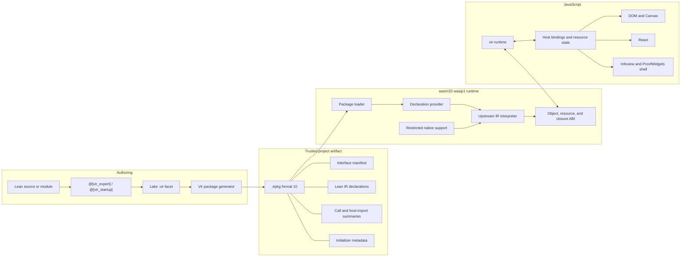

# VIR Project Review: Technical Appendix

This appendix records the evidence behind
[the project review](PROJECT_REVIEW.md). Measurements are dated evidence, not
performance promises. The 2026-08-10 refresh is current; the original
2026-07-30 baseline remains below so that the review's evolution is auditable.

## 2026-08-10 Current Refresh

Environment and repository:

| Item | Current value |
| --- | --- |
| Commit | `062fc8f4c24c1f35c43d92c38beb0782976c7e03` |
| Lean | 4.33.0-rc2, commit `d8b18978322de05a8f3dba51ef03cf5461676c17` |
| Node / npm | 24.18.0 / 11.16.0 |
| Package ABI / SDK | format 10 / 0.1.0 development version |
| Delta from original review | 24 commits; 255 files; +43,392 / -3,912 lines |
| Local worktrees / branches | 33 / 32 |
| Open PRs | 4, all drafts |
| Tags / GitHub releases | 0 / 0 |
| Primary human contributors | 1 |
| Submitted reviews on ten latest merged PRs | 0 |

Exact-head validation:

| Evidence | Result |
| --- | --- |
| Main CI | [Passed](https://github.com/ejgallego/lean-vir/actions/runs/31336353034) |
| Pages build and deployment | [Passed](https://github.com/ejgallego/lean-vir/actions/runs/31336353178) |
| Differential fixtures | 98 passed, 0 unsupported, 0 failed |
| Runtime smoke | 18 tests: 13 pure and 5 Lean-backed |
| Browser | Real Chromium passed in normal CI |
| Local doctor | 10 OK, 0 warnings, 0 failures |
| Production audit | 0 vulnerabilities |
| Full development audit | 3 high, 1 low |

Current measured runtime frontier:

| Measurement | Value |
| --- | ---: |
| Installed Lean IR universe | 398,519 functions |
| Runnable all-IR functions | 322,027 (80.8%) |
| Public constants | 36,887 |
| Runnable public constants | 29,217 (79.2%) |
| Explicit native capabilities | 461 |
| Stripped release Wasm | 723,398 bytes |
| Deterministic gzip | 163,593 bytes |

“Runnable” means the static dependency walk reaches no unsupported terminal
boundary. It does not mean every declaration has a supported JavaScript
interface, useful browser semantics, or workload validation.

### Current architecture and performance evidence

- Module `:vir` facets emit dependency-first modular package sets rather than
  forcing one root package to own every reached declaration.
- Export, startup, and host-import failures are reported at declaration time
  through shared typed classifiers.
- Package declaration indexing improved fresh-entry lookup by roughly 6.6x in
  the independent acceptance run and halved controlled Illuminate callback
  time.
- Custom-inductive normalization-plan caching improved the representative
  `Std.Format` lowering paired median by 61.9% and full calls by 36.2%; the
  focused empty-node row improved by 80.4% and 62.7% respectively.
- Timed runtime calls expose marshal, execute, nested-host, decode, and total
  phases without changing the Wasm ABI.
- The standalone browser benchmark compares JavaScript, VIR JSON, VIR typed
  `Std.Format`, FIR-native, and LLVM/Emscripten. Illuminate is a peer example;
  some rehearsals remain explicitly non-authoritative.

### Declaration-provider experiment

The bounded experiment inserted the same 1,651 decoded declarations into a
real `Lean.Environment` through public Lean APIs and used upstream declaration
lookup. Both artifacts passed the complete differential and browser smoke
surface with identical checksums.

| Measurement | Indexed provider | Real environment | Delta |
| --- | ---: | ---: | ---: |
| Stripped Wasm | 657,333 B | 4,107,316 B | +3,449,983 B (+524.8%) |
| Deterministic gzip | 150,177 B | 753,638 B | +603,461 B (+401.8%) |
| Fresh entry | 168.7 / 163.3 us | 217.3 / 193.4 us | about +19% paired median |
| Package load | 27.28 / 20.99 ms | 44.74 / 35.79 ms | about +60% paired median |

The decision is to retain the indexed provider and request upstream feedback
on a narrow caller-owned declaration-provider entry point. Package formats,
native policy, initialization policy, and cross-entry cache state stay out of
that first proposal. See
[ULC-0001](../roadmap/cards/ULC-0001-ir-declaration-lookup-boundary/README.md).

### Current draft disposition

| PR | Current state | Review disposition |
| --- | --- | --- |
| [#103 Foreign JS resource lifetimes](https://github.com/ejgallego/lean-vir/pull/103) | Draft, clean, all CI green; 9 commits, 46 files, +6,081/-1,358 | Primary implementation evidence for L-003; require independent contract review or exclude its surface from v0.1 |
| [#101 Stateful browser APIs](https://github.com/ejgallego/lean-vir/pull/101) | Draft; browser smoke fails on an uncancelled animation frame | Keep draft until cancellation and ownership semantics agree |
| [#120 Browser artifact catalog](https://github.com/ejgallego/lean-vir/pull/120) | Draft, clean, CI and candidate build green | Sequence independently; not a core runtime or first-pilot blocker |
| [#57 React type anchors](https://github.com/ejgallego/lean-vir/pull/57) | Old draft, merge-conflicted, about 32K generated/report additions | Extract only if the binding architecture selects and owns this report pipeline |

The current product sequencing decision is recorded in
[DEC-007](../DECISIONS.md#dec-007--resolve-binding-and-lifecycle-semantics-before-freezing-v01).

## Original 2026-07-30 Baseline

## Method

The review used a new linked worktree at
`b528eddb94a46e16f649b290958e4bd2bd1df08a`. Generated outputs stayed under
ignored build directories.

Environment:

| Item | Value |
| --- | --- |
| Review date | 2026-07-30 |
| Host | Linux x86-64 |
| Node | 24.18.0 |
| npm | 11.16.0 |
| Lean | 4.32.0, commit `8c9756b28d64dab099da31a4c09229a9e6a2ef35` |
| Lake | 5.0.0 |
| WASI SDK | 33.0 |
| Browser | Google Chrome through `/usr/bin/google-chrome` |
| Package ABI | format 10; SDK 0.1.0 |

Repository snapshot:

| Item | Value |
| --- | ---: |
| Commits | 194 |
| GitHub contributors | 1 primary contributor |
| Open issues | 0 |
| Open PRs | 2, both drafts |
| Tags/releases | 0 / 0 |
| Stars/forks/watchers | 4 / 1 / 0 |
| Tracked source, script, and documentation lines in the review inventory | 62,044 |
| Tracked generated infoview bundle | 7,234 lines |
| API coverage rows | 38: 29 supported, 8 partial, 1 missing |
| Conformance fixtures | 82 |

The GitHub counts describe adoption evidence, not project quality. The
repository is young and primarily internal.

## Architecture



The replacement point for future module-backed loading is the declaration
provider, not the upstream interpreter or general platform shim. This boundary
is one of the project's strongest architectural choices.

### Call directions

JavaScript-to-Lean:

1. validate the embedded interface manifest;
2. resolve an exported Lean name to a package-local slot;
3. lower JavaScript values to owned Lean objects using the manifest descriptor;
4. call `vir_call_resolved_objects`;
5. interpret real Lean IR;
6. lift the owned result and release temporary objects.

Lean-to-JavaScript:

1. collect `@[vir_js]` declarations into the package host-import table;
2. execute a generated, restricted trampoline;
3. lift opaque resources or callbacks into the runtime host state;
4. invoke an explicit JavaScript target;
5. validate a synchronous result and lower it back to Lean;
6. retain or release callbacks according to the host-binding ownership rule.

Opaque browser resources use `externref`. Lean closures remain Lean heap
objects rooted behind opaque `VirCallback` values; reference types do not
replace their retain/release protocol.

## Public Interface Inventory

| Interface | Current contract | Review conclusion |
| --- | --- | --- |
| `@[vir_export]` | Explicit JavaScript-callable declaration | Suitable for pilots; supported type subset must stay explicit |
| `@[vir_startup]` | Exported, zero-JS-argument, `Unit`-returning startup hook | Suitable for pilots; retry and replacement behavior is well tested |
| Module `:vir` facet | Builds marked module package and report | Strong client path; validate on a tagged downstream release |
| Package `:virSdk` facet | Installs and verifies matching SDK | Mechanically strong but release-blocked today |
| `.irpkg` format 10 | Trusted declaration package and interface metadata | Experimental ABI; version and compatibility policy need a first real release |
| `createVirRuntime` / factory | Instantiate compiled Wasm and a package runtime | Strong lifecycle behavior; surface remains experimental |
| `call` | Manifest-driven synchronous exported call | Appropriate core API |
| `runStartupEntries` | Ordered, retry-safe startup execution | Appropriate browser integration API |
| package replacement | Validate fresh instance, then dispose old instance | Strong failure semantics; single active package remains explicit |
| `dispose` | Terminal best-effort cleanup with aggregate errors | Strong contract and test coverage |
| host bindings | Explicit synchronous target map | Keep sync-only until a concrete async pilot exists |
| `Vir.Browser` | Typed wrappers over a selected DOM/canvas surface | Add operations only from real use cases |
| `Vir.React` | React-shaped node, component, prop, event, and hook surface | Good direction; parity remains pilot-driven |
| `Vir.Infoview` / `Vir.ProofWidgets` | Live package shell and partial compatibility facade | Research-quality pilot surface |

## Validation Results

| Command or scenario | Result | Wall time | Peak RSS reported by `/usr/bin/time` |
| --- | --- | ---: | ---: |
| `npm ci` | 20 packages installed; audit warning recorded below | 0.8 s | not recorded |
| fresh `npm run setup` | Pass; source and SDK downloaded, five packages and Wasm built | 242.11 s | 15.8 GB |
| `npm run doctor` | 10 OK, 0 warnings, 0 failures | under 1 s | not recorded |
| `npm test` | Pass | 119.67 s | 15.8 GB |
| runtime smoke | 13 groups passed | 32.22 s within `npm test` | included above |
| fixture smoke | 82 passed, 0 unsupported, 0 failed | 16.18 s within `npm test` | included above |
| `npm run test:site` | Build, package, and static Pages checks passed | 45.32 s | 15.8 GB |
| browser smoke with Google Chrome | Pass | 8.45 s | 230 MB |

The test suite validates:

- ABI versions, descriptor tags, 201 native extern entries, boundary registry,
  and 200 boxed wrappers;
- the marked-module and SDK Lake facets;
- `externref` behavior and the absence of JSPI in the tested Node runtime;
- direct calls, structured values, package corruption and replacement,
  callbacks, browser resources, React lifecycle, and SDK imports;
- parser, expression, task, string, array, numeric, recursive, and pretty
  printer fixture slices;
- landing, runner, React, format, callbacks, cleanup, recursive shapes, and
  failure paths in a real browser.

### Browser discovery finding

`doctor` selected `/snap/bin/chromium` first. That binary failed in the review
container before DevTools startup because Snap could not create a transient
DBus scope. The same suite passed immediately with
`CHROMIUM=/usr/bin/google-chrome`. This is not a runtime correctness failure,
but it is a reproducible onboarding and diagnostics issue.

### CI coverage

Recent `main`, PR, and Pages workflow runs were green. The normal CI covers
package/ABI checks, Wasm feature probes, release builds, the SDK artifact,
upstream smoke, Lake integration, runtime tests, and fixtures. Pages covers the
site build and static artifact checks. Neither workflow runs the real
`test:pages:browser` command.

### Downstream-client validation

The review cloned `ejgallego/lean-vir-examples` at
`242fa8f076882abbcb7ae61478d6dac34170d0c7` without modifying it.

| Step | Result | Wall time |
| --- | --- | ---: |
| `lake update` | Pinned VIR dependency fetched | 10.64 s |
| `scripts/prepare-web.sh` | SDK artifact downloaded; Basic and Slides packages built and staged | 21.14 s |
| `node scripts/smoke-node.mjs` | Pass | 0.05 s |
| web `npm ci` | Pass; two development advisories | 0.7 s |
| web `npm run build` | Pass | 0.36 s |
| headless Chrome explicit-call page | Returned total `18` and greeting `Hello, Lean` | Pass |
| headless Chrome startup slide | Lean-created DOM and canvas present; animation reached frame 1 | Pass |

This is a real separate-repository integration, but still maintainer-owned
dogfood. It is pinned to VIR
`f76efcc3467b3a64c67460b2e3478441b73f30c2` and Lean 4.32.0-rc1. The SDK
download succeeded through an authenticated GitHub Actions artifact. The result
therefore validates the unreleased commit path and the all-hands demo, while
also confirming that release consumption and downstream toolchain upgrades
remain open product work.

## Artifact Measurements

### Wasm and distribution

| Artifact | Raw/archive bytes | gzip or archive size |
| --- | ---: | ---: |
| stripped release `vir-upstream.wasm` | 617,363 | 140,700 bytes with `gzip -9 -n` |
| debug companion `vir-upstream.dev.wasm` | 3,754,101 | about 928.5 KiB with `gzip -9 -n` |
| `lean-vir-sdk.tar.gz` | n/a | 1,158,204 |
| `lean-vir-local.tar.gz` | n/a | 1,533,858 |

The debug Wasm size is dominated by debug custom sections. In the measured
unstripped artifact, code plus data is about 594 KiB. The largest code/data
areas are the WASI C++ runtime, Lean C runtime, and VIR package loader; the
upstream interpreter itself is about 32 KiB of code.

### Representative packages

| Package | Bytes | Declarations | Exports | Host imports |
| --- | ---: | ---: | ---: | ---: |
| `demo-host.irpkg` | 1,133,485 | 3,083 | 55 | 84 |
| `fixtures-basic.irpkg` | 314,844 | 730 | 106 | 0 |
| `fixtures-boundary.irpkg` | 62,258 | 268 | 26 | 0 |
| `fixtures-lean.irpkg` | 908,670 | 1,555 | 25 | 0 |
| `pretty-printer.irpkg` | 102,580 | 217 | 6 | 0 |

Declaration payloads account for 91.2% of the aggregate bytes across these
packages. Interface manifests are user-facing product data and account for
7.7%; the other metadata sections are individually below 1%.

### Performance baseline

The benchmark report was generated with:

```bash
npm run bench -- --json build/perf/project-review-main.json
```

It took 1,021.52 seconds including a cold benchmark-artifact build. Selected
median results:

| Row | Per operation | Interpretation |
| --- | ---: | --- |
| resolve name and call | 1.6 µs | Package-local resolution plus empty object call |
| cached slot call | 1.2 µs | 24% below resolve-each-call |
| `fib 17` | 2.93 ms | 2.0x the host Lean IR baseline |
| sort/checksum, 16 items | 102.3 µs | 3.1x the host Lean IR baseline |
| scalar/base calls | 6.4–21.4 µs | `Float32` through `Float` in the measured set |
| `ByteArray`, 128 bytes | 7.9 µs | Full call and result lift |
| `Array Nat`, 64 items | 161.5 µs | Full call; JS lowering alone was 85.8 µs |
| `Array String`, 32 items | 121.5 µs | Full call; JS lowering alone was 35.8 µs |
| nested record/list/option | 37.1 µs | Full top-level call |
| recursive custom inductive | 48.4 µs | Full top-level call |
| host scalar handshake | 41.4 µs | Lean-to-JavaScript host crossing |
| callback root round trip | 13.0 µs | Callback creation, call, and release loop |
| DOM listener create/remove | 29.8 µs | Resource churn |
| React root lifecycle | 117.0 µs | Mount/render/unmount loop |
| React text tree, 40 children | 3.18 ms | One rendered tree |
| React callback tree, 20 handlers | 391.5 ms as currently sampled | Confounded by deferred cleanup across synchronous samples; see below |

Absolute numbers are machine-specific. The stable interpretation is:

- call-slot resolution is not a dominant cost;
- small scalar/object boundaries are in the microsecond range;
- the interpreter controls are 2–3x the same host IR interpreter workload;
- collection lowering becomes material for larger object graphs;
- callback-bearing React trees need a corrected steady-state measurement and a
  separate accumulation stress test.

#### React callback diagnostic

`benchWasmRepeated` takes seven synchronous samples. Replaced React nodes and
their Lean callbacks are intentionally released in queued microtasks, so the
standard callback-tree row does not yield between samples. Later samples
inherit thousands of pending callbacks from earlier samples.

A focused diagnostic yielded after every top-level call:

| Workload | Observed result |
| --- | ---: |
| one 20-handler render | approximately 4–8 ms |
| 50 renders inside one synchronous Lean call | 254 ms total, 5.1 ms/render |
| 100 renders inside one synchronous Lean call | 827 ms total, 8.3 ms/render |
| 150 renders inside one synchronous Lean call | 2.30 s total, 15.4 ms/render |
| 200 renders inside one synchronous Lean call | 5.53 s total, 27.7 ms/render |

The focused runs are single samples and not release benchmarks. They establish
the semantics of the anomaly: ordinary calls can release after their
JavaScript turn, while a long synchronous Lean rerender loop accumulates
deferred callback cleanup and degrades nonlinearly.

The benchmark should split this into:

1. a steady-state row that yields and flushes between independent samples;
2. a clearly named synchronous callback-retention stress row.

Keep the JSON report as a local or CI artifact. Absolute numbers are
machine-specific; future changes should use the paired runner and compare the
same row, iteration count, and checksum.

## Package And Runtime Limits

| Limit | Current behavior | Product implication |
| --- | --- | --- |
| Package trust | Manifest and declaration/layout metadata are trusted | Generated/local packages only |
| Active package | One loaded instance, replaceable atomically | No multi-package linking promise |
| Module input | VIR `.irpkg`, not general `.olean` or module data | This is selected-code execution, not Lean in the browser |
| Host imports | Synchronous; Promise results rejected | Async APIs use callback registration and cancellation |
| Host import count | At most 128 declarations | Adequate for current demos; keep visible |
| Host import IR arity | At most 6 | Export a wrapper for wider calls |
| Interface types | Explicit supported structural subset | Unsupported exports fail generation |
| Memory | 4 MiB initial linear memory; 1 MiB stack by default | Inputs beyond demo range need measurement |
| Recovery | A synchronous call can trap or hang its current worker/tab | Untrusted use requires a worker and budgets |
| Threads | Single-threaded runtime assumptions and stubs | No concurrent Lean execution promise |
| JSPI | Unavailable in the tested Node runtime | No Promise-shaped import plan today |

## Dependency Audit

`npm audit --omit=dev` reports zero vulnerabilities. The full audit reports:

| Package | Severity | Scope | Disposition |
| --- | --- | --- | --- |
| Vite 8.0.13 | High | Windows development-server path/UNC handling | Update and rerun site/browser checks |
| PostCSS 8.5.14 | High | Transitive development source-map loading | Update through Vite dependency resolution |
| esbuild 0.27.7 | Low | Windows development-server file handling | Evaluate 0.28 with bundle checks |

These advisories affect development tooling, not the packaged Lean/Wasm
runtime. The loopback-only documented dev server reduces exposure but does not
remove the maintenance action.

## Risk Register

| Risk | Likelihood | Impact | Current control | Next control or trigger |
| --- | --- | --- | --- | --- |
| No consumable release | Certain | High for pilots | Commit/local-archive SDK paths | Publish and validate the first tag |
| Package lies about its ABI | Possible for uncontrolled input | High | Trusted-package policy and JS manifest checks | Wasm validation, limits, and worker only for untrusted use |
| Main contributor unavailable | Material | High | Extensive documentation and tests | Name pilot/release co-owners and perform one handoff |
| Lean upgrade changes IR/runtime ABI | Recurring | High | Pinned source commit, native inventories, fixtures | Make upgrade validation a release gate |
| Encoder/decoder drift | Recurring | High | Shared numeric tags and negative tests | Generate more schema/field-order checks |
| Browser regressions reach `main` | Possible | Medium | Local browser suite | Portable CI browser job |
| First setup exceeds developer memory | Possible | Medium/high | Cached rebuilds and explicit setup | Reproduce, document, and provide lower parallelism |
| Long synchronous React rerender retains callback trees until the turn ends | Demonstrated by stress workload | Medium/high for callback-heavy UI | Deferred release and teardown tests | Separate steady-state/stress metrics and bound pilot render patterns |
| Feature breadth outruns users | Likely without gates | High maintenance | Existing roadmap notes | Require a pilot for React/RPC/async expansion |
| Dev-server advisory exploited | Low in current Linux loopback workflow | Medium | Local bind and no production Vite server | Dependency update |
| Package and Wasm size grows silently | Possible | Medium | Size and benchmark scripts | Store release baselines and review deltas |

## Work And Branch Disposition

No branch is included in the `main` review baseline.

| Branch or PR | State | Recommendation |
| --- | --- | --- |
| PR #94 / `chore/native-support-module-manifest` | Open draft, four commits, green last PR CI | Refresh on `main` and merge if its fixed-point provider selection remains simpler and deterministic; this directly reduces Lean-upgrade maintenance |
| PR #57 / `feat/react-type-sources` | Open draft, nine commits, roughly 32K generated/report lines | Keep draft; extract its API-gap findings, but land the report pipeline only if the React/ProofWidgets pilot will maintain and use it |
| `chore/host-import-trampolines` | One useful maintenance commit, 28 commits behind | Rebase and measure code-size/readability effect after PR #94; land only if the generated table is clearly simpler |
| `feat/funcref-table-probe` | One probe commit, 37 commits behind | Compare with the current Wasm feature probe; port only missing actionable coverage, then retire |
| `feat/react-context-hook` | One feature commit, 35 commits behind | Keep parked until a selected React or ProofWidgets port uses context |
| `feat/type-anchors` | Earlier precursor to PR #57 | Superseded; retire after preserving any unique notes |
| `feat/typed-ir-call-bridge` | One large commit, 79 commits behind | The current object ABI and package call path supersede its direction; archive |
| `chore/facet-example-migration` | One commit near the Lake facet work | Re-evaluate against current examples; keep only a concrete simplification not already delivered by #89 |
| `docs/worktree-first-harness` | Old documentation commit, 39 behind | Current `AGENTS.md` and contributing docs already express the workflow; retire |
| `feat/lake-vir-facet` | Source branch for merged PR #89 | Retire after confirming no unique follow-up |
| `feat/verso-slides-vir` | Content represented in current infoview work | Retire the local worktree/branch after maintainer confirmation |
| `fix/wasm32-target-fixtures` | Release/dev artifact work is present on `main` | Retire after maintainer confirmation |
| `chore/deduplicate-toolchain-version` | Merged as #96 | Retire |
| `chore/lean-4.32.0` | Merged as #95 | Retire |
| `feat/marked-export-diagnostics` | Points directly at current `main` | Retire or reuse only after renaming for a new task |

The review does not delete branches or worktrees. Cleanup is intentionally a
separate maintainer-approved operation.

## Review-Relevant Source Map

Use the existing owner documents rather than copying implementation details
into this event pack:

- [Developer Guide](../DEVELOPER_GUIDE.md) for call flow and ownership.
- [Upstream Boundary](../UPSTREAM_BOUNDARY.md) for interpreter, runtime, and
  native support policy.
- [Interface Pipeline](../INTERFACE_PIPELINE.md) for types, manifests, and
  trust.
- [JavaScript API](../JS_API.md) for runtime behavior and limits.
- [Performance](../PERFORMANCE.md) and
  [IR Package Payload Analysis](../IRPKG_PAYLOAD_ANALYSIS.md) for measurements.
- [API Coverage](../API_COVERAGE.md) for the canonical feature inventory.
